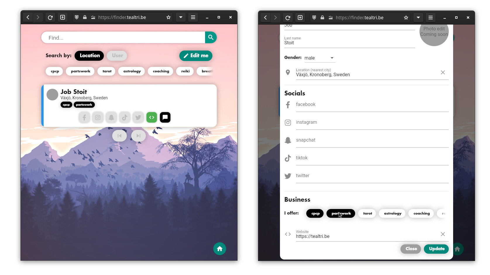

The tealtribe community webite hosted over at [https://tealtri.be](https://tealtri.be).

Tealtribe is a spiritual community of people following [Teal Swan](https://tealswan.com)'s teachings.
It's mission is to end seperation within and end seperation and loneliness within the world.
The site is created to bring the members of the Tealtribe together so they can support one another in their journey.

For more technical information about the site check [the docs](./docs/technical.md)

# The site
The site is the portal for members to find the resources they are looking for.
The site contains a blog and it contains all the information the members might need.
THe site links to the various apps available for the members such as [the finder](#the-finder) and [the chat](#the-chat)

## The finder

The finder is an application that allows users to share their closest city location along with their socials.
This allows other users to then find them by location.
A user can search for a city location an find all members who shared their location.
The user then has the means to contact them via the given socials.
The finder also has a link to the [chat](#the-chat).

## The chat
The site hosts it's own [matrix](https://matrix.org) chat and an [element](https://element.io) webclient to chat.
Members are able to login with their tealtribe login and chat with one another.

